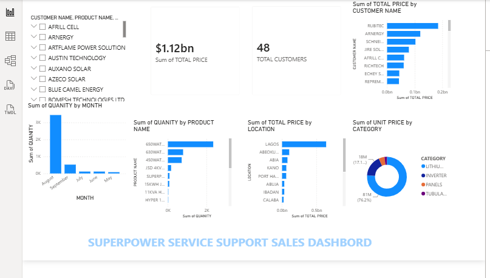

# Data-analytics-portfolio
Welcome to my data analytics portfolio.
This repository showcases practical projects where I use data to understand business performance and present useful findings.
# About me
I am a computer science graduate with an interest in data analytics and business intelligence. 
I enjoy working with data to identify useful information, understanding trends, and support better decision-making.

## Skills & Tools
- Microsoft Excel
- Power BI
- SQL
- Python

## Projects
### Superpower Sales Dashboard
A sales analysis project based on sales records from Superpower Support services.
The project focuses on organizing, sales data, calculating total sales, and creating a dashboard to make the information easier to understand
## Project Files

## Key Areas Analyzed
- Sales performance
- Product performance and quantity sold
- Customer purchasing patterns
- Sales returns and warranty record
- Monthly and yearly Sales performing products
- Business performance through Power BI dashboards
   
## Project Objective
The main objective of this project is to turn raw sales records into useful information that can help a business understand its sales activities and make better decisions

## Contact
- Email:adedigbaadewunmi@gmail.com
- GitHub:@adedibgba-adewunmi

